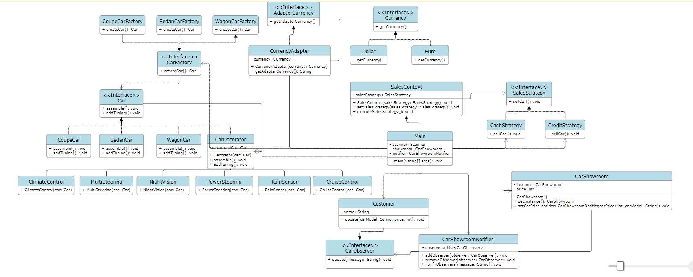

# FinalSDP
Name of your final project: Car Dealership

Group: SE-2213

Team members: Alibi Baigaliyev

## Project Overview:

### • Provide some information about your project. 

The project is an automobile dealership system implemented in Java, incorporating six design patterns: Singleton, Factory, Decorator, Adapter, Strategy, and Observer. The application allows users to order cars, choose models, customize vehicles with additional options, select payment methods (credit or cash), choose currency for cash payments, and adjust car prices.

### • Describe the idea of the project.

The idea is to create a comprehensive system for managing an automobile dealership, covering aspects such as inventory management, order processing, customization options, and payment methods. The design patterns are utilized to ensure flexibility, maintainability, and scalability of the system.

### • The purpose of the work. 

The purpose is to develop a well-structured and modular automobile dealership system that can easily adapt to changes and enhancements. The design patterns are chosen to address specific concerns, such as ensuring a single instance of the dealership (Singleton), facilitating the creation of diverse car models (Factory), enhancing cars with additional features (Decorator), adapting currencies for payment (Adapter), selecting payment strategies (Strategy), and notifying clients of price changes (Observer).

### • The objectives of the work.
- Implement a Singleton pattern for the dealership to ensure there is only one instance.
- Use the Factory pattern to create different car models efficiently.
- Apply the Decorator pattern to allow dynamic customization of cars with additional features.
- Utilize the Adapter pattern to adapt various currencies for payment processing.
- Implement the Strategy pattern for flexible payment method selection (credit or cash).
- Use the Observer pattern to notify clients when there are changes in car prices.
  
## Main body:

### • Include explanations of each feature and design pattern. Provide screenshots, if necessary (for example, we used observer to notify users about something).

Singleton:

Ensures that there is only one instance of the dealership, preventing multiple instances and ensuring centralized control.

Factory:

Facilitates the creation of different car models with a unified interface, promoting easy scalability for future additions.

Decorator:

Enables dynamic customization of cars by allowing the addition of features or options without modifying the existing code.

Adapter:

Adapts various currencies for payment, providing a seamless payment experience for customers using different currencies.

Strategy:

Allows users to choose between different payment strategies, such as credit or cash, providing flexibility for payment processing.

Observer:

Clients are registered as observers to receive notifications when there are changes in car prices, keeping them informed.

### • Include UML diagram to illustrate the structure of the design patterns used in your project.

## Conclusion:

### • Key points of your project. Mention used patterns.

- The project successfully integrates six design patterns to achieve a robust and flexible automobile dealership system.
- Singleton ensures a single instance of the dealership, while Factory enables efficient creation of various car models.
- Decorator allows dynamic customization, Adapter adapts currencies, Strategy enables flexible payment methods, and Observer notifies clients of price changes.

### • Project outcomes. Challenges faced. 

- The project has resulted in a modular and scalable system with a user-friendly interface.
- Challenges included coordinating the interactions between different design patterns and ensuring seamless integration.

### • Future improvements.

- Enhance the user interface for a more intuitive experience.
- Integrate additional features such as maintenance scheduling and customer reviews.
